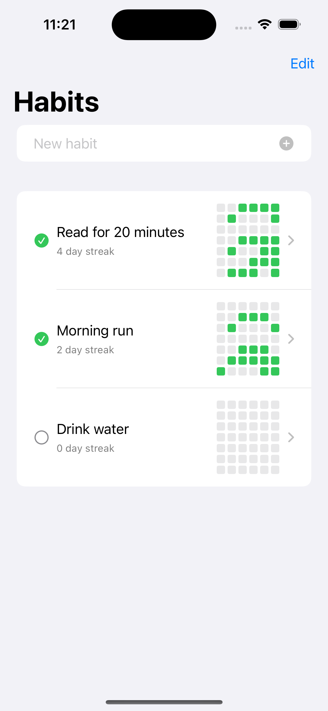
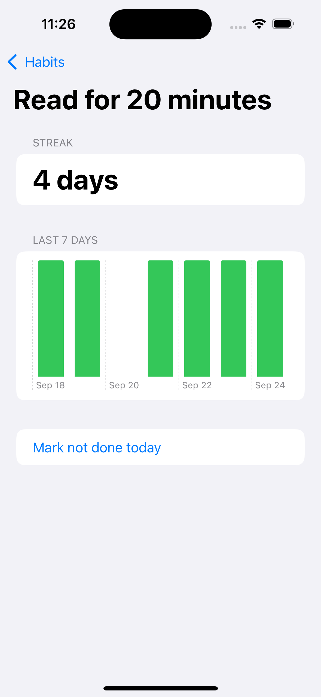

# Habit Tracker

App 3 of 10, moving from React Native and Flutter into native SwiftUI. First app in the series with real persistence via SwiftData instead of UserDefaults.

## Goal

Learn SwiftData: the @Model macro, relationships between model instances, and querying with @Query. Also wanted to try Swift Charts for the first time with a simple bar chart, and build a small reusable view (the heatmap grid) instead of one-off inline UI.

## What it does

Track daily habits, mark them done, and see a streak count, a GitHub style activity heatmap, and a 7 day completion chart per habit.

## Screenshots

  
  

## License

MIT, see [LICENSE](LICENSE).

---

Built by [Rishav Jha](https://rishavjha.com)
